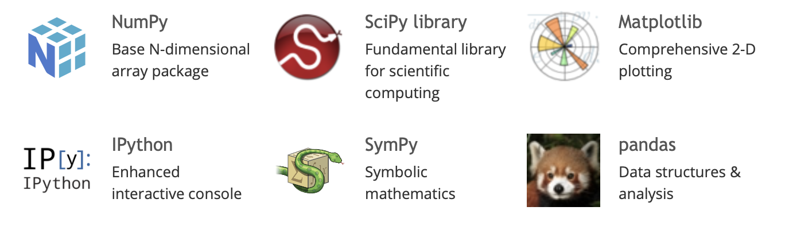

# General introduction about NumPy & SciPy

## Overall introduction
Python is a powerful language for rich source of data science tools. And NumPy and SciPy family is one of the packages frequently used in mathematical computation in Python, which is a good replacement for MatLab. If you are seeking for free and efficient software, SciPy might be a good choice.

<div align='center'>
    
</div>

SciPy family has a modules for linear algebra, optimization, interpolation, image processing and so on, which are often used in fields like statistics, data secience & analysis, machine learning and engineering. The NumPy array is strong in time and memory efficiency, which supports fast computation, and much more efficient than barely using iterations. The NumPy array is strong because it has been optimized by parallel programming and more advanced algorithm, I will list examples later. Also, other Python modules, like Matplotlib, Pandas, Autograd and PyTorch extend NumPy array to support their functionality, which makes the array very portable.

"(from scipy official webpage) SciPy (pronounced “Sigh Pie”) is a Python-based ecosystem of open-source software for mathematics, science, and engineering. In particular, these are some of the core packages:"
<div align="center">
    
</div>

## Code snippet
In this section, I will show some interesting code snippets for SciPy and NumPy functionality.

This is how SciPy processes an image.
```python
# from Python Numpy Tutorial (with Jupyter and Colab) by CS231n: Convolutional Neural Networks for Visual Recognition
# of Stanford
from scipy.misc import imread, imsave, imresize

# Read an JPEG image into a numpy array
img = imread('assets/cat.jpg')
print(img.dtype, img.shape)  # Prints "uint8 (400, 248, 3)"

# We can tint the image by scaling each of the color channels
# by a different scalar constant. The image has shape (400, 248, 3);
# we multiply it by the array [1, 0.95, 0.9] of shape (3,);
# numpy broadcasting means that this leaves the red channel unchanged,
# and multiplies the green and blue channels by 0.95 and 0.9
# respectively.
img_tinted = img * [1, 0.95, 0.9]

# Resize the tinted image to be 300 by 300 pixels.
img_tinted = imresize(img_tinted, (300, 300))

# Write the tinted image back to disk
imsave('assets/cat_tinted.jpg', img_tinted)
```
<div align="center">
    
</div>
<p align="center">
<i>Left: The original image. Right: The tinted and resized image.</i>
</p>

This is how Numpy processes arrays.
```python
# from Python Numpy Tutorial (with Jupyter and Colab) by CS231n: Convolutional Neural Networks for Visual Recognition
# of Stanford
import numpy as np

a = np.array([1, 2, 3])   # Create a rank 1 array
print(type(a))            # Prints "<class 'numpy.ndarray'>"
print(a.shape)            # Prints "(3,)"
print(a[0], a[1], a[2])   # Prints "1 2 3"
a[0] = 5                  # Change an element of the array
print(a)                  # Prints "[5, 2, 3]"

b = np.array([[1,2,3],[4,5,6]])    # Create a rank 2 array
print(b.shape)                     # Prints "(2, 3)"
print(b[0, 0], b[0, 1], b[1, 0])   # Prints "1 2 4"

a = np.zeros((2,2))   # Create an array of all zeros
print(a)              # Prints "[[ 0.  0.]
                      #          [ 0.  0.]]"

b = np.ones((1,2))    # Create an array of all ones
print(b)              # Prints "[[ 1.  1.]]"

c = np.full((2,2), 7)  # Create a constant array
print(c)               # Prints "[[ 7.  7.]
                       #          [ 7.  7.]]"

d = np.eye(2)         # Create a 2x2 identity matrix
print(d)              # Prints "[[ 1.  0.]
                      #          [ 0.  1.]]"

e = np.random.random((2,2))  # Create an array filled with random values
print(e)                     # Might print "[[ 0.91940167  0.08143941]
                             #               [ 0.68744134  0.87236687]]"
```

## References
- Figure 1: [SciPy](https://se.ewi.tudelft.nl/desosa2019/chapters/scipy/)
- Figure 2: [SciPy.org](https://www.scipy.org)
- Figure 3: [Python Numpy Tutorial (with Jupyter and Colab)](https://cs231n.github.io/python-numpy-tutorial/)
- [SciPy](https://en.wikipedia.org/wiki/SciPy)
- [SciPy.org](https://www.scipy.org)
- [Python Numpy Tutorial (with Jupyter and Colab)](https://cs231n.github.io/python-numpy-tutorial/)
