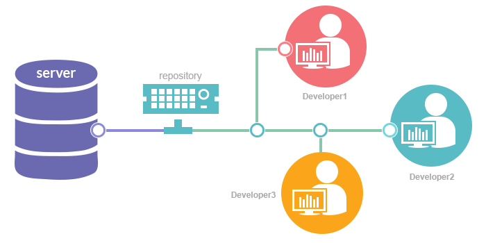

# Explanation about Github: What is Github? Why use Github? How to use Github?
## What is Github?

<i>"GibHub is a code hosting platform for collaboration and version control." -- From Github</i>

From our understanding, GitHub is a website that can helps developers (like us) store, manage, and share their code. It also can help them track and control changes to their code. So what is Github exactly? We can know from these two principles: __Version control__ and __Git__.

### What is Version Control?

Version control is the practice of tracking and managing changes to software code. It keeps track of every modification fof the code in database. If developers make any mistake, they can return back to the earlier version of the code to fix that mistake. For a group work on Github, team members can always view changes.

In the future, we will introduce two important techniques in vesion control - __branching__ and __merging__. These two techniques allow developers make changes in their group works.

### What is Git?

Git is the most widely used modern __version control system__ in the world today. Git was developed by Linus Torvalds in 2005. The entire codebase and histroy is avaiable on every developer's computer, which allows for easy braching and merging.

### What is Github Then?
According to Github website, it is company which offers the distributed verion control and source code management functionality for Git. Companies and individual developers can easily use Github for verion control and collaboration.

Github has a user-firendly interface for users. Developers can upload their works either using its website or directly using the command line. In the later weeks, we will introduce how to create our first git repositories in these two different ways.

Anyone can sign up and host a public code repository for free! If you havn't used Github before, you won't regret learning through our tutorials! Please stay tuned for our later tutorials! See you next week!

## References
- Figure 1: [What is GitHub?](https://medium.com/@fengyuan.yap/what-is-github-260412a0dcd7)
- Figure 2: [Need of Version Control Systems](https://medium.com/@vemulasrinivas2505/version-control-systems-74375eb48961)
- Figure 3: [Git Working Areas](https://blog.knoldus.com/git-working-areas/)
- [What Is GitHub? A Beginner’s Introduction to GitHub](https://kinsta.com/knowledgebase/what-is-github/)
- [GitHub - Wikipedia](https://en.wikipedia.org/wiki/GitHub)
- [Hello World · GitHub Guides](https://guides.github.com/activities/hello-world/)
- [What is version control | Atlassian Git Tutorial](https://www.atlassian.com/git/tutorials/what-is-version-control)
- [What is Git: become a pro at Git with this guide | Atlassian Git Tutorial](https://www.atlassian.com/git/tutorials/what-is-git)
