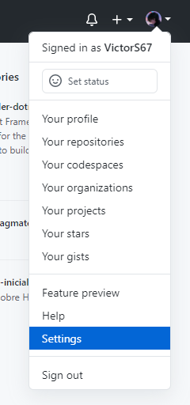
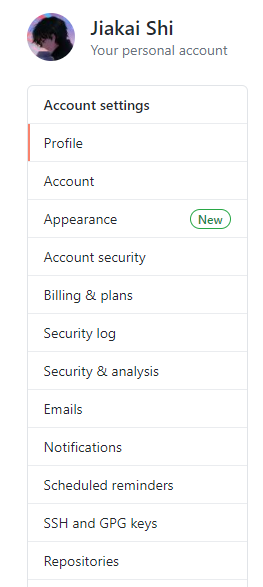
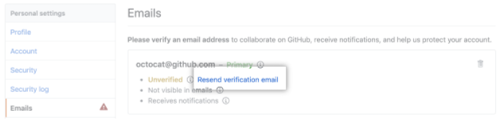
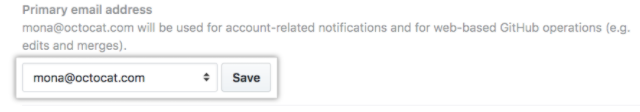

# How to register a Github account?
## Signing up for a new Github account
### Github offers user accounts for individuals and organizations for teams od people working together

1. Visit to the [Pricing page](https://github.com/pricing) in Github.
2. Read the information about the different products and subscriptions that Github offers, then click the upgrade button under the subscription you'd like to choose.
3. Follow the prompts to create your personal account or organization.

## Verifying your email address
### Verifying your primary email address ensures strengthened security, allows GitHub staff to better assist you if you forget your password, and gives you access to more features on GitHub.

You can verify your email address after signing up for a new account, or when you add a new email address. If an email address is undeliverable or bouncing, it will be unverified.

If you do not verify your email address, you will not be able to:

- Create or fork repositories
- Create isses or pull requests
- Comment on issues, pull requests, or commits
- Authorize OAuth App applications
- Generate personal access tokens
- Receive email notifications
- Star repositories
- Create or update project boards, including adding cards
- Create or update gists
- Create or use GitHub Actions
- Sponsor developer with GitHub Sponsors

### How to verify your email address

1. In the tab of your Github page, click your profile photo, and then click __Settings__.

  

2. In the left sidebar, click __Emails__.

  

3. Under __Emails__, click __Resend verification email__.

  

4. It will send you an verification email. After you click the link inside the email, it will take you to Github dashboard and observe a confirmation banner.

  

## Changing your primary email address
### You can change the email address associated with your user account at any time.

1. In the tab of your Github page, click your profile photo, and then click __Settings__.

  

2. In the left sidebar, click __Emails__.

  

3. Under __Emails__, add new email address.

  

4. Under __Primary email address__, you can use the drop-down menu to click the email address you'd like to set as your primary email address, and click __Save__.

  

5. If you want to remove the old email address from your account, next to the old email click 

6. Verify your new primary email address. Withour a verified email address, you won't be able to use all of GitHub's features.

## References
- [Signing up for a new GitHub account](https://docs.github.com/en/github/getting-started-with-github/signing-up-for-a-new-github-account)
- [Verifying your email address](https://docs.github.com/en/github/getting-started-with-github/verifying-your-email-address)
- [Changing your primary email address](https://docs.github.com/en/github/setting-up-and-managing-your-github-user-account/changing-your-primary-email-address)