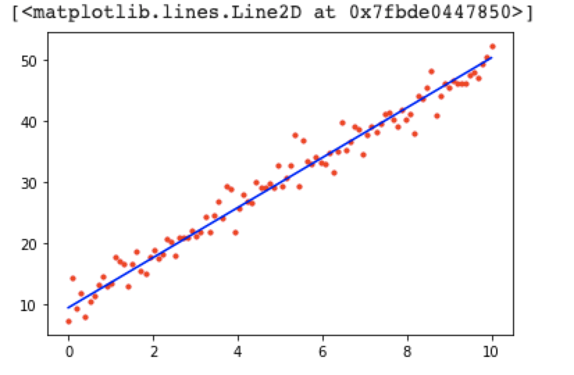

# Introduction to PyTorch

## Introduction
<div align="center">
  
</div>

**PyTorch** is an open source library in Python for machine learning developped by Facebook, based on the package *Torch*. Except for machine learning, this package is also used in computer vision and natural language processing. There are mainly two high-level features for PyTorch library:
- strong GPU acceleration by applying NumPy-like tensors
- Automatic differentiation system for deep neural neural network

## Features of PyTorch library
1. Tensors: vector in PyTorch (like NumPy array)
2. Datasets & DataLoaders: load and manipulate dataset
3. Transforms: transform and manipulate data representation in PyTorch (ex., Tensor)
4. Model: build models, like convolutional neural network (CNN), recurrent neural network (RNN), generative adversarial network (GAN)
5. Automatic differentiation: solving backpropagation - find gradient for loss with each parameter in the model in each turn of training
6. optimization: optimize the parameters (ex., gradient descent, stochastic gradient descent)
7. save and load model

## Code Snippet
- Tensor
```Python
>>> x = torch.tensor([1.0, 2.0, 3.0, 4.0])
>>> x
tensor([1., 2., 3., 4.])

>>> x_np = np.array([1.0, 2.0, 3.0, 4.0], dtype=np.float32)
>>> x = torch.from_numpy(x_np)

# Torch abstracts over NumPy but uses a NumPy-compatible representation under the hood
>>> x_np[0] = 100.0
>>> x[1] = 200.0
>>> x.data.numpy()[2] = 300

>>> x
tensor([100., 200., 300.,   4.])

# Broadcasting
>>> x.reshape(-1, 1) + x

tensor([[200., 300., 400., 104.],
        [300., 400., 500., 204.],
        [400., 500., 600., 304.],
        [104., 204., 304.,   8.]])

# Dot product
>>> x @ x.T
tensor(140016.)
```
- GPU
```Python
>>> device = torch.device("cuda" if torch.cuda.is_available() else "cpu")
>>> device
device(type='cuda')

>>> x = x.to(device=device)
>>> x
tensor([100., 200., 300.,   4.], device='cuda:0')

>>> x @ x.T
tensor(140016., device='cuda:0')
```
- Automatic differentiation
```Python
def f(x):
    return x ** 2 + 2 * x + 6


np_x = np.array([4.0])
x = torch.from_numpy(np_x).requires_grad_(True)
y = f(x)
print(y) # tensor([30.], dtype=torch.float64, grad_fn=<AddBackward0>)

y.backward()
x.grad # tensor([10.], dtype=torch.float64)

np_x = np.array([5.0])
x = torch.from_numpy(np_x).requires_grad_(True)
y = f(x)
y.backward()
x.grad # tensor([12.], dtype=torch.float64)
```
- Linear regression
```Python
# In our synthetic data, we have w = 4 and b = 10
N = 100  # Number of training data points
x = np.linspace(0, 10, N)

t = 4 * x + 10 + npr.normal(0, 2, x.shape[0])
plt.plot(x, t, "r.")

x = torch.from_numpy(x)
t = torch.from_numpy(t)

# Initialize random parameters
params = {
    "w": torch.randn(1).requires_grad_(True),
    "b": torch.randn(1).requires_grad_(True),
}


def cost(params):
    y = params["w"] * x + params["b"]
    return (1 / N) * torch.sum(0.5 * (y - t) ** 2)


# Find the gradient of the cost function using pytorch
num_epochs = 1000  # Number of epochs of training
alpha = 0.01  # Learning rate

for i in range(num_epochs):
    # Evaluate the gradient of the current parameters stored in params
    loss = cost(params)
    loss.backward()

    if i % 100 == 0:
        print(f"i: {i:<5d} loss: {loss.item():.4f}")

    # Update parameters w and b
    with torch.no_grad():
        params["w"].data = params["w"] - alpha * params["w"].grad
        params["b"].data = params["b"] - alpha * params["b"].grad
        params["w"].grad.zero_()
        params["b"].grad.zero_()

print(params)

"""
i: 0     loss: 392.1020
i: 100   loss: 8.4249
i: 200   loss: 5.8527
i: 300   loss: 4.2880
i: 400   loss: 3.3361
i: 500   loss: 2.7570
i: 600   loss: 2.4047
i: 700   loss: 2.1904
i: 800   loss: 2.0600
i: 900   loss: 1.9807
{'w': tensor([4.0975], requires_grad=True), 'b': tensor([9.4508], requires_grad=True)}
"""

# Plot the training data again, together with the line defined by y = wx + b
# where w and b are our final learned parameters
plt.plot(x, t, "r.")
plt.plot([0, 10], [params["b"], params["w"] * 10 + params["b"]], "b-")
```
<div align="center">
  
</div>

## Reference
- [Wikipedia: PyTorch](https://en.wikipedia.org/wiki/PyTorch)
- [PyTorch official tutorial](https://pytorch.org/tutorials/beginner/basics/data_tutorial.html)
