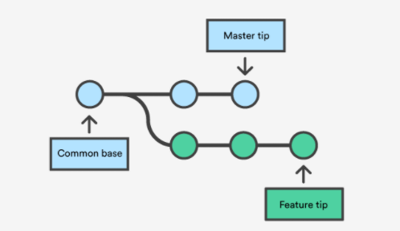
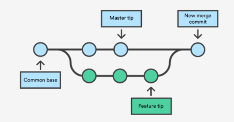
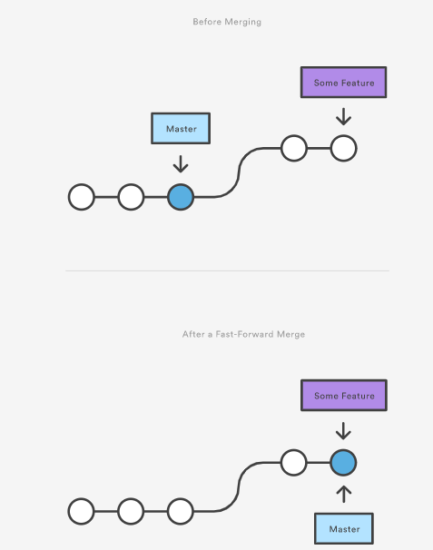
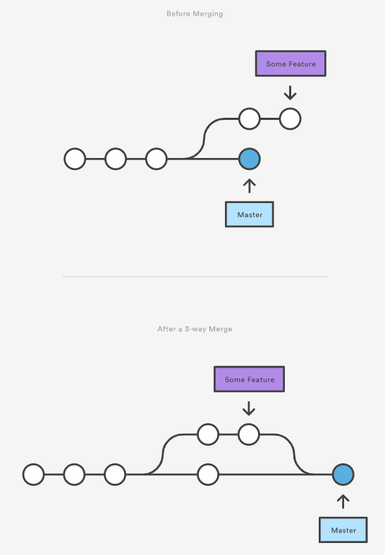

# What is Branch? Why merge occurs?
Merging is Git's way of putting a forked history back together again. The __git merge__ command lets you take the independent lines of development created by __git branch__ and integrate them into a single branch.

Note that all of the commands presented below merge into the current branch. The current branch will be updated to reflect the merge, but the target branch will be completely unaffected. Again, this means that __git merge__ is often used in conjunction with __git checkout__ for selecting the current branch and __git branch -d__ for deleting the obsolete target branch. 

## How merging works?
__git merge__ will combine multiple sequences of commits into one unified history. In the most frequent use cases, __git merge__ is used to combine two branches. The following examples in this document will focus on this branch merging pattern. In these scenarios, __git merge__ takes two commit pointers, usually the branch tips, and will find a common base commit between them. Once Git finds a common base commit it will create a new "merge commit" that combines the changes of each queued merge commit sequence.

Let's consider an example:
We have a new branch feature that is based off the __master__ branch. We want to merge this feature branch into __master__.

  

Invoking __git merge__ will merge the specified branch feature into the current branch, we'll assume __master__. Git will determine the merge algorithm automatically.

  

Merge commits are unique against other commits in the fact that they have two parent commits. When creating a merge commit Git will attempt to auto magically merge the separate histories for you. If Git encounters a piece of data that is changed in both histories it will be unable to automatically combine them. This scenario is a version control conflict and Git will need user intervention to continue.

## Before merging
### Confirm the receiving branch
Execute __git status__ to ensure that HEAD is pointing to the correct merge-receiving branch. If need, execute __git checkout__ to switch to the receiving branch. In out case we will execute __git checkout master__.

### Fetch latest remote commits
Make sure the receiving branch and the merging branch and up-to-date with the latest remote changes. Execute __git fetch__ to pull the latest remote commits. Once the fetch is completed ensure the __master__ branch has the latest updates by executing __git pull__.

## Merging
A merge can be initiated by executing __git merge *name*__, where __*name*__ is the name of the branch that will be merged into reveicing branch.

### Fast Forward Merge
A fast-forward merge can occur when there is a linear path from the current branch tip to the target branch.

  

Instead of “actually” merging the branches, all Git has to do to integrate the histories is move (i.e., “fast forward”) the current branch tip up to the target branch tip. This effectively combines the histories, since all of the commits reachable from the target branch are now available through the current one. 

<pre>
<code>
# Start a new feature
git checkout -b new-feature master
# Edit some files
git add filename
git commit -m "Start a feature"
# Edit some files
git add filename
git commit -m "Finish a feature"
# Merge in the new-feature branch
git checkout master
git merge new-feature
git branch -d new-feature
</code>
</pre>

### 3-way Merge
However, a fast-forward merge is not possible if the branches have diverged. When there is not a linear path to the target branch, Git has no choice but to combine them via a 3-way merge.

  

 3-way merges use a dedicated commit to tie together the two histories. The nomenclature comes from the fact that Git uses three commits to generate the merge commit: the two branch tips and their common ancestor.
<pre>
<code>
# Start a new feature
git checkout -b new-feature master
# Edit some files
git add filename
git commit -m "Start a feature"
# Edit some files
git add filename
git commit -m "Finish a feature"
# Develop the master branch
git checkout master
# Edit some files
git add filename
git commit -m "Make some super-stable changes to master"
# Merge in the new-feature branch
git merge new-feature
git branch -d new-feature
</code>
</pre>

## Resolving conflict
If the two branches you're trying to merge both changed the same part of the same file, Git won't be able to figure out which version to use. When such a situation occurs, it stops right before the merge commit so that you can resolve the conflicts manually.

When you encounter a merge conflict, running the __git status__ command shows you which files need to be resolved.

## How conflicts are presented
When Git encounters a conflict during a merge, It will edit the content of the affected files with visual indicators that mark both sides of the conflicted content. 
<pre>
<code>
here is some content not affected by the conflict
"<<<<<<< master"
this is conflicted text from master
"======="
this is conflicted text from feature branch
">>>>>>> feature branch;"
</code>
</pre>

## References
- [Git Merge](https://www.atlassian.com/git/tutorials/using-branches/git-merge)