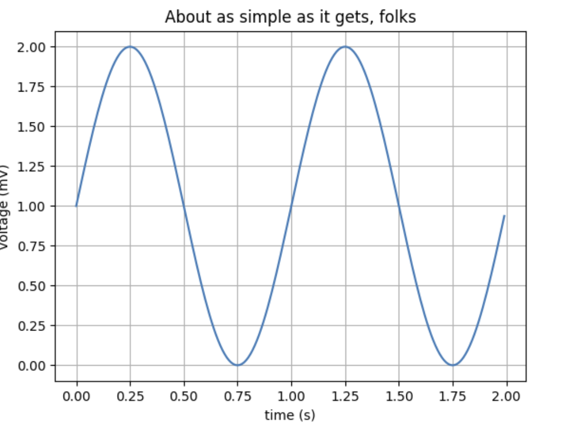
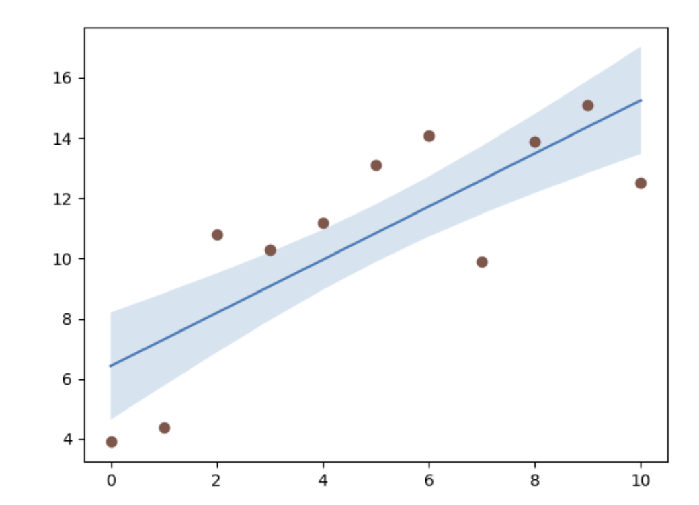
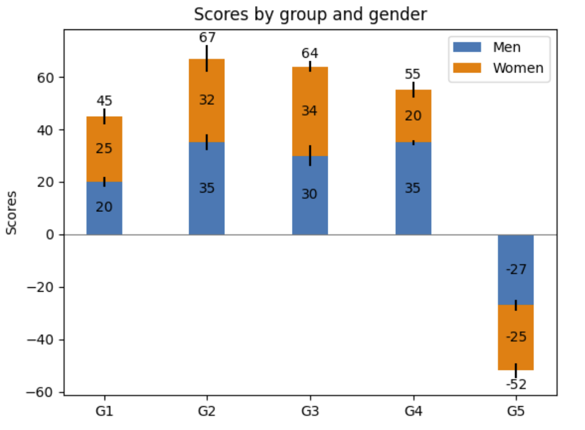
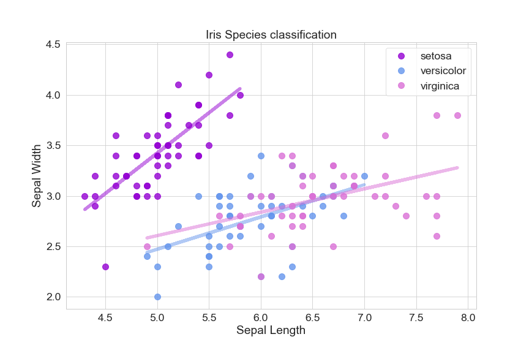
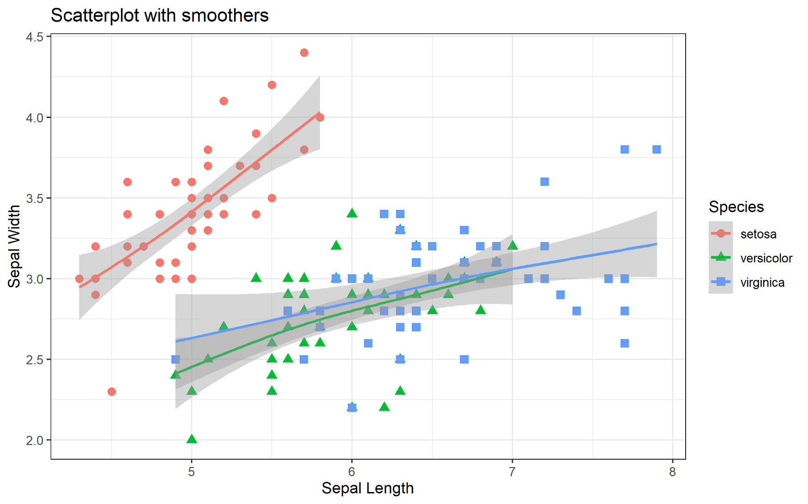
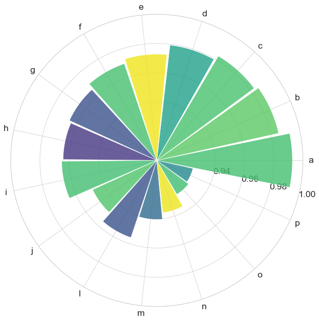
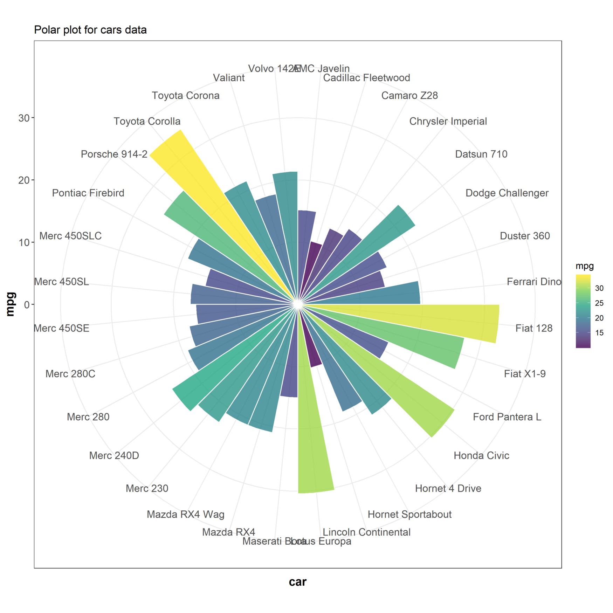
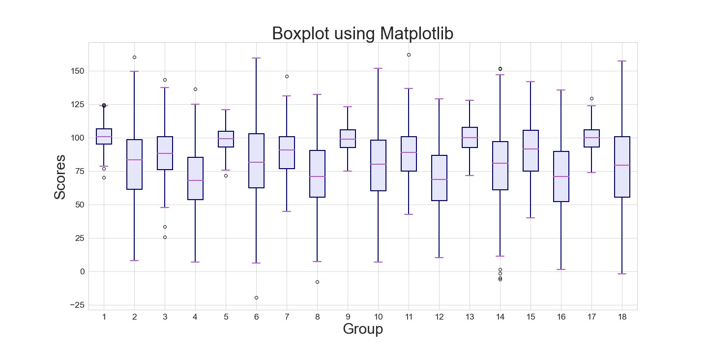
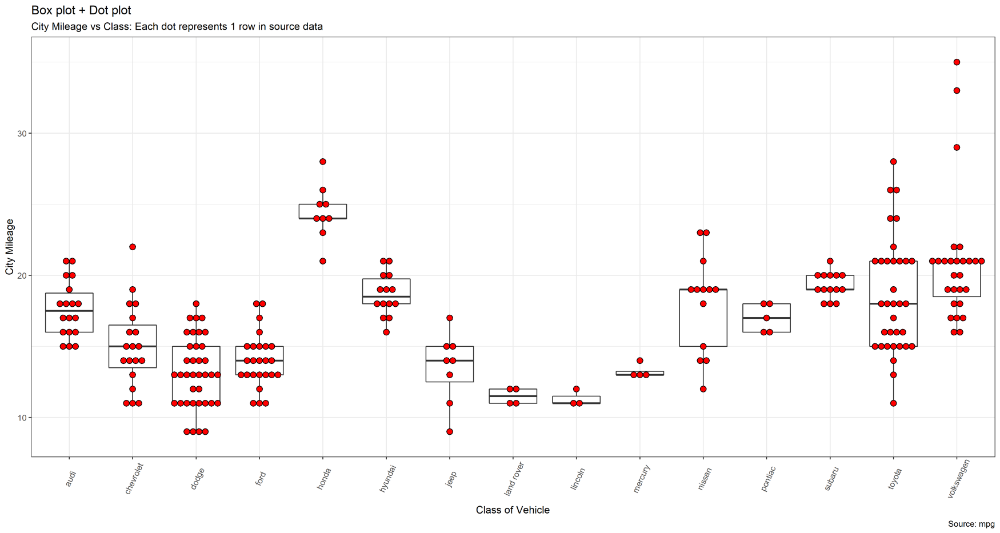

# Introduction to Matplotlib

## Let's start!
Based on the official site of Matplotlib, Matplotlib is a visualization tool in Python, it is an open source and free "comprehensive library for creating static, animated, and interactive visualizations in Python".
<div align="center">
  
</div>

Simply speaking, Matplotlib is a Python programming library for plotting, and it works with NumPy and SciPy. The library provides an object-oriented API for plotting with general-purpose GUI toolkits, for example, wxPython and GTK.
<div align="center">
  
</div>

## Comparison with Matlab
- Matplotlib provides Matlab style interface
- Incorporates the ability of Matlab in Python, but free and open source 

## Code snippet
```Python
# simple plot
import matplotlib
import matplotlib.pyplot as plt
import numpy as np

# Data for plotting
t = np.arange(0.0, 2.0, 0.01)
s = 1 + np.sin(2 * np.pi * t)

fig, ax = plt.subplots()
ax.plot(t, s)

ax.set(xlabel='time (s)', ylabel='voltage (mV)',
       title='About as simple as it gets, folks')
ax.grid()

fig.savefig("test.png")
plt.show()
```
<div align="center">
  
</div>

```Python
# Confidence bands
import matplotlib.pyplot as plt
import numpy as np

N = 21
x = np.linspace(0, 10, 11)
y = [3.9, 4.4, 10.8, 10.3, 11.2, 13.1, 14.1,  9.9, 13.9, 15.1, 12.5]

# fit a linear curve an estimate its y-values and their error.
a, b = np.polyfit(x, y, deg=1)
y_est = a * x + b
y_err = x.std() * np.sqrt(1/len(x) +
                          (x - x.mean())**2 / np.sum((x - x.mean())**2))

fig, ax = plt.subplots()
ax.plot(x, y_est, '-')
ax.fill_between(x, y_est - y_err, y_est + y_err, alpha=0.2)
ax.plot(x, y, 'o', color='tab:brown')
```
<div align="center">
  
</div>

```Python
# bar chart demo

import matplotlib
import matplotlib.pyplot as plt
import numpy as np

N = 5
menMeans = (20, 35, 30, 35, -27)
womenMeans = (25, 32, 34, 20, -25)
menStd = (2, 3, 4, 1, 2)
womenStd = (3, 5, 2, 3, 3)
ind = np.arange(N)    # the x locations for the groups
width = 0.35       # the width of the bars: can also be len(x) sequence

fig, ax = plt.subplots()

p1 = ax.bar(ind, menMeans, width, yerr=menStd, label='Men')
p2 = ax.bar(ind, womenMeans, width,
            bottom=menMeans, yerr=womenStd, label='Women')

ax.axhline(0, color='grey', linewidth=0.8)
ax.set_ylabel('Scores')
ax.set_title('Scores by group and gender')
ax.set_xticks(ind)
ax.set_xticklabels(('G1', 'G2', 'G3', 'G4', 'G5'))
ax.legend()

# Label with label_type 'center' instead of the default 'edge'
ax.bar_label(p1, label_type='center')
ax.bar_label(p2, label_type='center')
ax.bar_label(p2)

plt.show()
```
<div align="center">
  
</div>

## Matplotlib VS Ggplot2
**Recommended Reading: [Matplotlib VS Ggplot2](https://towardsdatascience.com/matplotlib-vs-ggplot2-c86dd35a9378), I got examples from this technical blog.**
In this section, I use the examples from the readings to compare the performance on plotting some common diagrams of two packages from different languages, and lay the output images below To make the appropriate comparison, the author use the same data, and try to make the graphs as similar as possible.

1. scatter plot
<div align="center">

<p>scatter plot using python</P>

<p>scatter plot using R</P>
</div>

### Matplotlib (python) code snippet
```python
plt.figure(figsize=(17,10))
plt.scatter(fat['weight'], fat['height'], c=fat['brozek'],s=fat['siri']**2 , alpha=0.7,cmap = 'gnuplot2')
plt.title('Weight vs Height with color gradient representing Brozek',fontsize=25)
plt.xlabel('Weight', fontsize=20)
plt.ylabel('Height', fontsize=20)
plt.grid(True)
cb= plt.colorbar()
cb.set_label('Brozek', fontsize=20)
plt.show()
```

### Ggplot2 (R) code snippet
```R
# Scatter plot
sp3<-ggplot(fat, aes(x=weight, y=height, color=brozek)) + geom_point(aes(size = siri), alpha=0.7) +
  ggtitle("Weight vs Height with color gradient representing Brozek")
sp3+ scale_color_gradient(low="blue", high="yellow")+ theme_bw()
ggsave( width = 7, height = 5, dpi = 300,"scatter_ggplot.png")
```

2. contour plot
For example, elevation and depth in geographical maps, magnetic field. 
<div align="center">

<p>contour plot using python</P>

<p>contour plot using R</P>
</div>

### Matplotlib (python) code snippet
```python
fig, ax = plt.subplots(figsize=(15,15))
#gridx, gridy 

divider = make_axes_locatable(ax)
ax_cb = divider.new_horizontal(size="5%", pad=0.05)
fig.add_axes(ax_cb)
c =ax.contour( np.rot90(np.fliplr(Z_error)), colors='white',extent=[xmin, xmax, ymin, ymax])

plt.clabel(c, inline=True, fontsize=8)
#contours = plt.contour(np.rot90(Z_error),3, colors='black')
im= ax.imshow(np.rot90(Z_error), cmap='viridis',
          extent=[xmin, xmax, ymin, ymax], alpha = 1)

plt.colorbar(im, cax=ax_cb)

#ax.plot(amy, acc, 'k.', markersize=2)
ax.set_xlim([xmin, xmax])
ax.set_ylim([ymin, ymax])
ax.set_title('Conditional KDE contour plot of Error, orientation=2')
ax.set_xlabel('Amygdala')
ax.set_ylabel('Acc')
plt.show()
```

### Ggplot2 (R) code snippet
```R
# contour bands
m + stat_density2d(aes(fill = ..density..), geom = "raster", contour = FALSE)+ 

    stat_density2d(size = 0.5, colour = "white")+
   scale_fill_viridis_c(option = "C",alpha =1) 
ggsave( width = 10, height = 8, dpi = 300,"contour_ggplot.png")
```

## heatmap
For example, correlation heatmap, confusion matrix.
<div align="center">

<p>contour plot using python</P>

<p>contour plot using R</P>
</div>

### Matplotlib (python) code snippet
```python
f = plt.figure(figsize=(19, 15))
plt.matshow(fat.corr(), fignum=f.number,cmap ='viridis')
plt.xticks(range(18),fat.columns, rotation=45) 
plt.yticks(range(18),fat.columns) 
cb = plt.colorbar()
cb.ax.tick_params(labelsize=14)
plt.title('Correlation Matrix', fontsize=16)
```

### Ggplot2 (R) code snippet
```R
#create correlation matrix
cormat <- round(cor(fat),2)
melted_cormat <- melt(cormat)

#plot heatmap
ggplot(data = melted_cormat, aes(x=Var1, y=Var2, fill=value)) + 
  geom_tile()+
   scale_fill_viridis_c(alpha = 1) +
  theme(axis.text.x = element_text(angle=45, vjust=0.6))+ggtitle("Correlation Matrix")
```

4. Regression Multiline graph
*Note: in this section, the author forgot to match the colors perfectly, and change some shapes in matplotlib plot because the matplotlib cannot draw the shadow region for the regression line, but can be easily done by ggplot2.*

<div align="center">

<p>scatter plot using python</P>

<p>scatter plot using R</P>
</div>

### Matplotlib (python) code snippet
```python
groups = iris1.groupby("species")
plt.figure(figsize=(12,8))
colors = {'setosa':'darkviolet', 'versicolor':'cornflowerblue', 'virginica':'orchid'}
for name, group in groups:
    plt.plot(group["sepal_length"], group["sepal_width"], marker="o", linestyle="", 
    label=name, ms=10, color=colors[name], alpha=.8)
    m, b = np.polyfit(group["sepal_length"], group["sepal_width"], 1)
    plt.plot(group["sepal_length"], m*group["sepal_length"]+b, linewidth=5, 
    color=colors[name], alpha=.5)
    
plt.legend()
plt.title('Iris Species classification')
plt.xlabel('Sepal Length')
plt.ylabel('Sepal Width')
```

### Ggplot2 (R) code snippet
```R
theme_set(theme_bw())
smooth <- ggplot(data=iris, aes(x=Sepal.Length, y=Sepal.Width, color=Species)) + 
  geom_point(aes(shape=Species), size=2.5) + xlab("Sepal Length") + ylab("Sepal Width") + 
  ggtitle("Scatterplot with smoothers")

# generalised additive model
smooth + geom_smooth(method="gam", formula= y~s(x, bs="cs"))
ggsave( width = 8, height = 5, dpi = 300,"iris_line_ggplot.png")
```
5. Multiline connected graph
<div align="center">

<p>scatter plot using python</P>

<p>scatter plot using R</P>
</div>

### Matplotlib (python) code snippet
```python
plt.figure(figsize=(20,15))
plt.plot( 'KNN1', data=teall2, marker='^',alpha=.7, markersize=20, color='indianred', linewidth=5)
plt.plot( 'KNN9', data=teall2, marker='D',alpha=.7, markersize=20, color='mediumorchid', linewidth=5)
plt.plot( 'KNN5', data=teall2, marker='o',alpha=.7, markersize=20, color='rebeccapurple', linewidth=5)
plt.plot( 'LR', data=teall2, marker='s',alpha=.7, markersize=20, color='navy', linewidth=5)
plt.legend( prop={'size':20})
plt.xlabel('Number of iterations', fontsize=20)
plt.ylabel('Test Error', fontsize=20)
plt.title('Model error over 100 iterations of CV, matplotlib', fontsize=25)
plt.savefig('linegraph_matplot.png')
```

### Ggplot2 (R) code snippet
```R
p <-ggplot(teall2, aes(x=1:nrow(teall2))) +    geom_line(aes(y = KNN1), color = "indianred") +
    geom_point(aes(y = KNN1,size = KNN1*2, alpha= 0.7), color = "indianred", shape = 15) + 
  geom_line(aes(y = KNN9), color="mediumpurple")+
    geom_point(aes(y = KNN9,size = KNN9*0.8, alpha= 0.7), color="mediumpurple", shape = 16) + 
  geom_line(aes(y = LR), color="navy")+
    geom_point(aes(y = LR,size = LR*0.5, alpha= 0.7), color="navy", shape = 17) +   
    geom_line(aes(y = KNN5), color = "darkorchid") +
    geom_point(aes(y = KNN5,size = KNN5*0.5, alpha= 0.7), color = "darkorchid", shape = 18) + 
    theme_bw()+
    ggtitle("Model error over 100 iterations of cross validation") +
    xlab("Number of iterations") + ylab("Model Error")

p + theme(
plot.title = element_text(color="navy", size=14, face="bold"),
axis.title.x = element_text(color="navy", size=14, face="bold"),
axis.title.y = element_text(color="navy", size=14, face="bold")
,legend.title = element_blank()) 
 # geom_line(aes(group=paste0(variable, InModule)))
ggsave( width = 10, height = 6, dpi = 300,"multilinegraph_ggplot.png")
```

6. polar bar chart
<div align="center">

<p>scatter plot using python</P>

<p>scatter plot using R</P>
</div>

### Matplotlib (python) code snippet
```python
#Dummy data
N = 15
theta = np.linspace(0.0, 2 * np.pi, N, endpoint=False)
r = np.array(
    [0.9928, 0.9854, 0.9829, 0.9794, 0.9727, 0.9698, 0.9657, 0.9641, 0.9651, 0.9482, 
    0.9557, 0.9404, 0.9360, 0.9270,0.9253])
width = np.array([0.4] * N)
label = ["a", "b", "c", "d", "e", "f", "g", "h", "i", "j", "l", "m", "n", "o", "p"]


fig = plt.gcf()
fig.set_size_inches(18.5, 10.5)
ax = plt.subplot(111, projection='polar')

ax.set_rlim(0.9, 1)
ax.set_rticks(np.arange(0.94, 1, 0.02))
ax.set_thetagrids(theta * 180 / np.pi)
ax.set_rlabel_position(-15)

ax.bar(x=theta, height=r-.9, width=width, bottom=0.9, alpha=0.8, tick_label=label,color=colors)

plt.show()
```

### Ggplot2 (R) code snippet
```R
mtcars$car = row.names(mtcars)
theme_set(theme_bw())
p = ggplot(mtcars, aes(x=car, y=mpg, fill=mpg)) 
  +geom_col(width = 1, color = "white") 

p <- p + coord_polar()+
   scale_fill_viridis_c(option = 'C', alpha = .8)
```

7. Multi Boxplot
<div align="center">

<p>scatter plot using python</P>

<p>scatter plot using R</P>
</div>

### Matplotlib (python) code snippet
```
fig = plt.figure(1, figsize=(20, 8))

# Create an axes instance
ax = fig.add_subplot(111)
bp = ax.boxplot(data_to_plot, patch_artist=True)

## change outline color, fill color and linewidth of the boxes
for box in bp['boxes']:
    # change outline color
    box.set( color='navy', linewidth=2)
    # change fill color
    box.set( facecolor = 'lavender' )

## change color and linewidth of the whiskers
for whisker in bp['whiskers']:
    whisker.set(color='navy', linewidth=2)

## change color and linewidth of the caps
for cap in bp['caps']:
    cap.set(color='mediumorchid', linewidth=2)

## change color and linewidth of the medians
for median in bp['medians']:
    median.set(color='mediumorchid', linewidth=2)

## change the style of fliers and their fill
for flier in bp['fliers']:
    flier.set(marker='o', color='navy', alpha=1)

plt.xlabel('Group', fontsize=30)
plt.ylabel('Scores', fontsize=30)
plt.title('Boxplot using Matplotlib', fontsize=35)
plt.savefig('box_matplot.png')
```

### Ggplot2 (R) code snippet
```R
theme_set(theme_bw())

# multi boxplot
g <- ggplot(mpg, aes(manufacturer, cty))
g + geom_boxplot() + 
  geom_dotplot(binaxis='y', stackdir='center',
              dotsize = .5, fill="red") +
  theme(axis.text.x = element_text(angle=65, vjust=0.6)) + 
  labs(title="Box plot + Dot plot", 
       subtitle="City Mileage vs Class: Each dot represents 1 row in source data",
       caption="Source: mpg",
       x="Class of Vehicle",
       y="City Mileage")
```

## Reference
- [matplotlib official website](https://matplotlib.org/)
- [Wikipedia term: Matplotlib](https://en.wikipedia.org/wiki/Matplotlib)
- [Matplotlib VS Ggplot2](https://towardsdatascience.com/matplotlib-vs-ggplot2-c86dd35a9378)
- [Matplotlib tutorial](https://matplotlib.org/stable/gallery/index.html)

