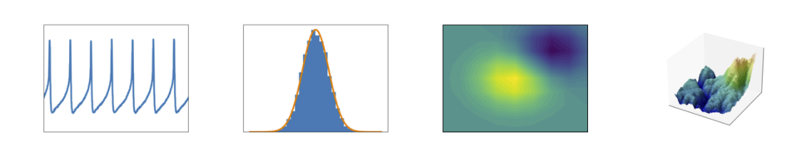
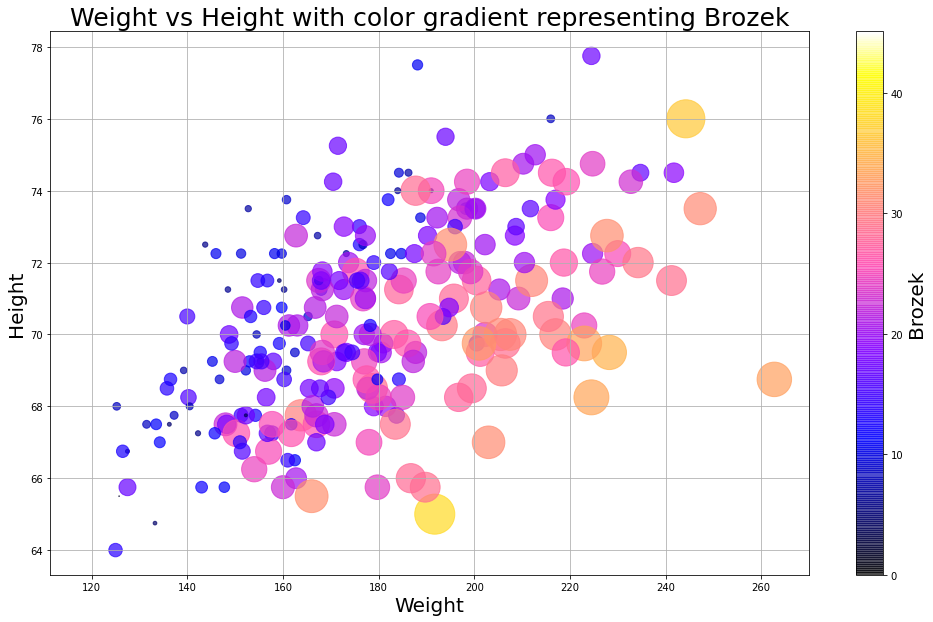
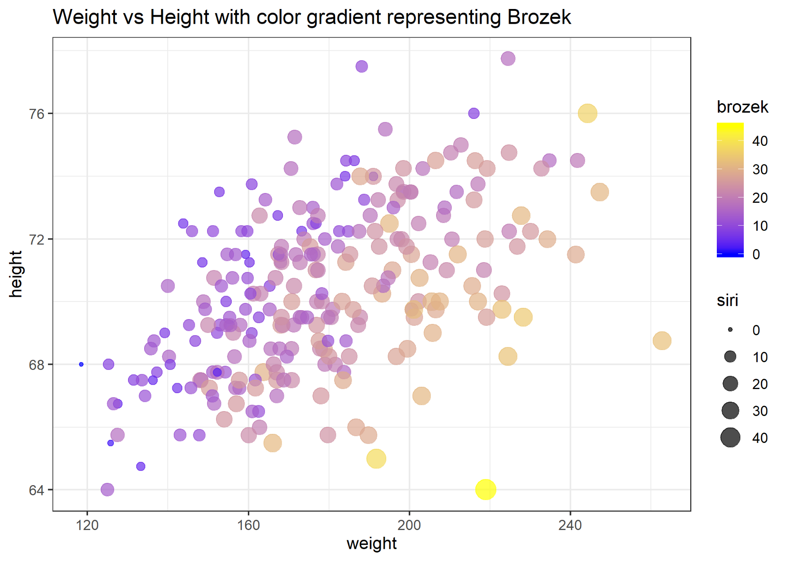
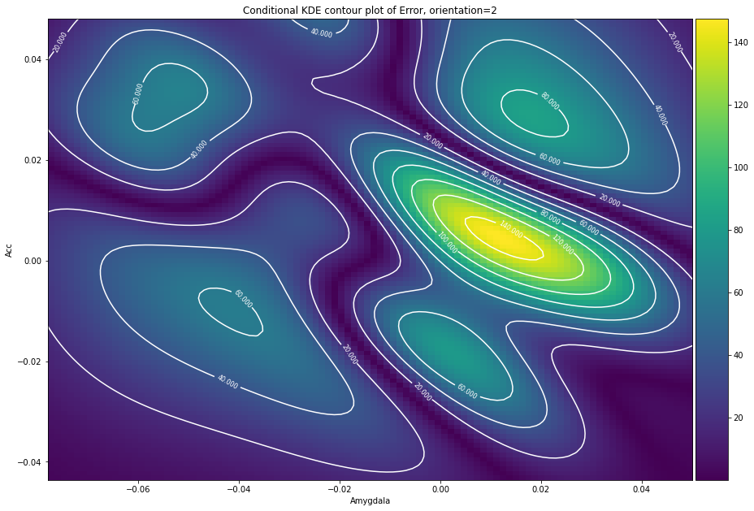
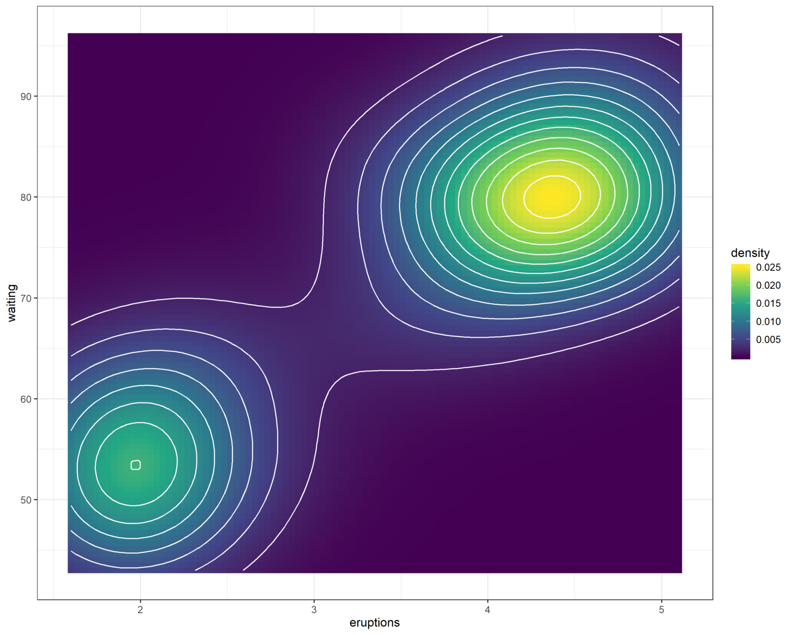
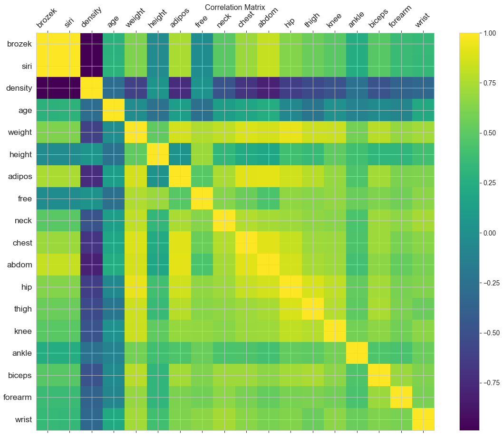
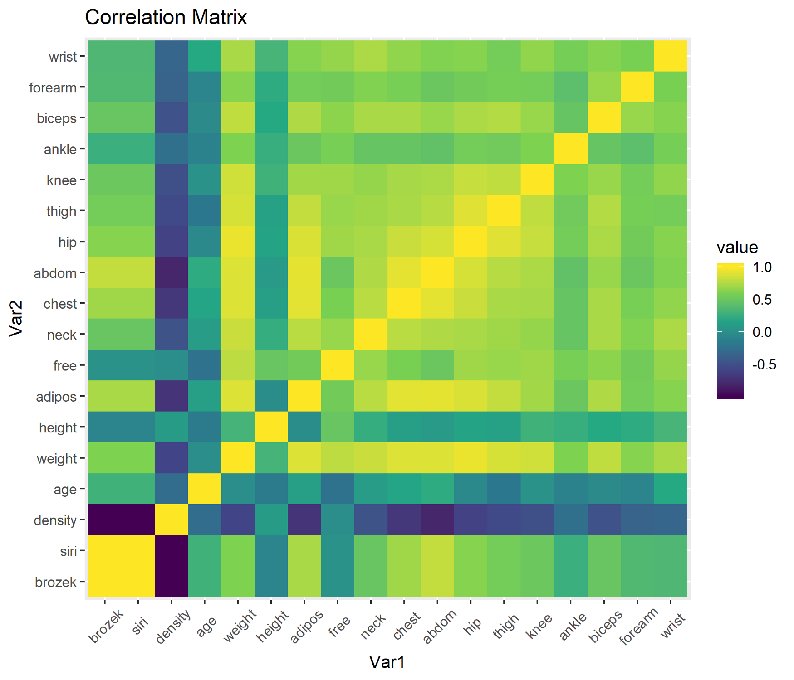

# Introduction to Matplotlib

## Let's start!
Based on the official site of Matplotlib, Matplotlib is a visualization tool in Python, it is an open source and free "comprehensive library for creating static, animated, and interactive visualizations in Python".
<div align="center">
  
</div>

Simply speaking, Matplotlib is a Python programming library for plotting, and it works with NumPy and SciPy. The library provides an object-oriented API for plotting with general-purpose GUI toolkits, for example, wxPython and GTK.
<div align="center">
  
</div>

## Comparison with Matlab
- Matplotlib provides Matlab style interface
- Incorporates the ability of Matlab in Python, but free and open source 

## Code snippet

## Matplotlib VS Ggplot2
**Recommended Reading: [Matplotlib VS Ggplot2](https://towardsdatascience.com/matplotlib-vs-ggplot2-c86dd35a9378)**
To make the appropriate comparison, we use the same data, and try to make the graphs as the same as possible.

1. scatter plot
<div align="center">

<p>scatter plot using python</P>

<p>scatter plot using R</P>
</div>

### Matplotlib (python) code snippet
```python
plt.figure(figsize=(17,10))
plt.scatter(fat['weight'], fat['height'], c=fat['brozek'],s=fat['siri']**2 , alpha=0.7,cmap = 'gnuplot2')
plt.title('Weight vs Height with color gradient representing Brozek',fontsize=25)
plt.xlabel('Weight', fontsize=20)
plt.ylabel('Height', fontsize=20)
plt.grid(True)
cb= plt.colorbar()
cb.set_label('Brozek', fontsize=20)
plt.show()
```

### Ggplot2 (R) code snippet
```R
# Scatter plot
sp3<-ggplot(fat, aes(x=weight, y=height, color=brozek)) + geom_point(aes(size = siri), alpha=0.7) +
  ggtitle("Weight vs Height with color gradient representing Brozek")
sp3+ scale_color_gradient(low="blue", high="yellow")+ theme_bw()
ggsave( width = 7, height = 5, dpi = 300,"scatter_ggplot.png")
```

2. contour plot
<div align="center">

<p>contour plot using python</P>

<p>contour plot using R</P>
</div>

### Matplotlib (python) code snippet
```python
fig, ax = plt.subplots(figsize=(15,15))
#gridx, gridy 

divider = make_axes_locatable(ax)
ax_cb = divider.new_horizontal(size="5%", pad=0.05)
fig.add_axes(ax_cb)
c =ax.contour( np.rot90(np.fliplr(Z_error)), colors='white',extent=[xmin, xmax, ymin, ymax])

plt.clabel(c, inline=True, fontsize=8)
#contours = plt.contour(np.rot90(Z_error),3, colors='black')
im= ax.imshow(np.rot90(Z_error), cmap='viridis',
          extent=[xmin, xmax, ymin, ymax], alpha = 1)

plt.colorbar(im, cax=ax_cb)

#ax.plot(amy, acc, 'k.', markersize=2)
ax.set_xlim([xmin, xmax])
ax.set_ylim([ymin, ymax])
ax.set_title('Conditional KDE contour plot of Error, orientation=2')
ax.set_xlabel('Amygdala')
ax.set_ylabel('Acc')
plt.show()
```

### Ggplot2 (R) code snippet
```R
# contour bands
m + stat_density2d(aes(fill = ..density..), geom = "raster", contour = FALSE)+ 

    stat_density2d(size = 0.5, colour = "white")+
   scale_fill_viridis_c(option = "C",alpha =1) 
ggsave( width = 10, height = 8, dpi = 300,"contour_ggplot.png")
```

## heatmap
For example, correlation heatmap, confusion matrix.
<div align="center">

<p>contour plot using python</P>

<p>contour plot using R</P>
</div>

### Matplotlib (python) code snippet
```python
f = plt.figure(figsize=(19, 15))
plt.matshow(fat.corr(), fignum=f.number,cmap ='viridis')
plt.xticks(range(18),fat.columns, rotation=45) 
plt.yticks(range(18),fat.columns) 
cb = plt.colorbar()
cb.ax.tick_params(labelsize=14)
plt.title('Correlation Matrix', fontsize=16)
```

### Ggplot2 (R) code snippet
```R
#create correlation matrix
cormat <- round(cor(fat),2)
melted_cormat <- melt(cormat)

#plot heatmap
ggplot(data = melted_cormat, aes(x=Var1, y=Var2, fill=value)) + 
  geom_tile()+
   scale_fill_viridis_c(alpha = 1) +
  theme(axis.text.x = element_text(angle=45, vjust=0.6))+ggtitle("Correlation Matrix")
```


## Reference
- [matplotlib official website](https://matplotlib.org/)
- [Wikipedia term: Matplotlib](https://en.wikipedia.org/wiki/Matplotlib)
- [Matplotlib VS Ggplot2](https://towardsdatascience.com/matplotlib-vs-ggplot2-c86dd35a9378)
