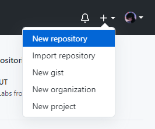
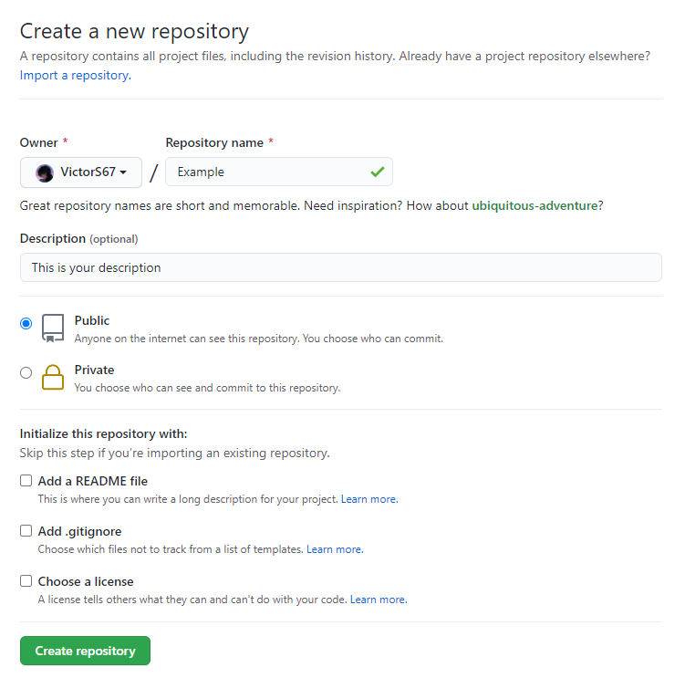

# Create your first project on Github
## Setting up git

1. Head to [http://git-scm.com/downloads](http://git-scm.com/downloads) and download Git.
2. Once Git has finished downloading, you'll need to let it know who you are, so it can add this information to all of your commits. Open your Terminal, and enter the following command:

<pre>
<code>
git config -- global user.name "Name"
git config -- global user.email "email@example.com"
</code>
</pre>

## Create Your First Repository
GitHub stores each project in its own online repository, so we need to create this repository.

1. Open your web browser, log into your GitHub account.
2. In the upper-right corner, click __'+'__ icon and select __New Repository__.

  

3. To create a new repository, you could do following steps:
- Give a name to your repository, and enter a description (or not, since this is optional)
- Decide whether your repository should be __public__, or __private__. Generally, you would make your repository to be public, so that others can view your repository (and download, even contribute). If you want to make your repository private, then only you can someone whom you invite as collaborators can view, download and contribute.
- You can add README file if you want. It is suggested to do so, since you are creating a new repository to show your work and a brief description is not enough. Details about creating README file will be introduced later.
- You can also add .gitignore file. This file is for Git to identify which file can be exluded while you commit your files to the repository. Details about creating .gitignore file will be introduced later.
- Choose a license for your project. If you are unsure which license is right for you, use [this link](https://choosealicense.com/) to know more information about the different licensing options.
- Click __Create repository__, and then it will direct you to a empty GitHub repository, which is the new repository you just create. Congradulations!

  

