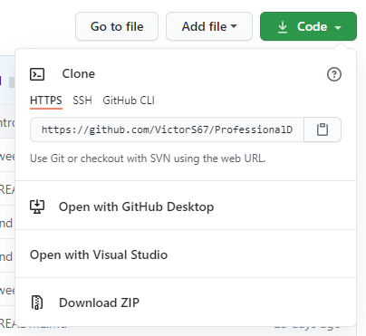

# Create your first project on Github
## Setting up git

1. Head to [http://git-scm.com/downloads](http://git-scm.com/downloads) and download Git.
2. Once Git has finished downloading, you'll need to let it know who you are, so it can add this information to all of your commits. Open your Terminal, and enter the following command:

<pre>
<code>
git config -- global user.name "Name"
git config -- global user.email "email@example.com"
</code>
</pre>

## Create Your First Repository
GitHub stores each project in its own online repository, so we need to create this repository.

1. Open your web browser, log into your GitHub account.
2. In the upper-right corner, click __'+'__ icon and select __New Repository__.

  

3. To create a new repository, you could do following steps:
- Give a name to your repository, and enter a description (or not, since this is optional)
- Decide whether your repository should be __public__, or __private__. Generally, you would make your repository to be public, so that others can view your repository (and download, even contribute). If you want to make your repository private, then only you can someone whom you invite as collaborators can view, download and contribute.
- You can add README file if you want. It is suggested to do so, since you are creating a new repository to show your work and a brief description is not enough. Details about creating README file will be introduced later.
- You can also add .gitignore file. This file is for Git to identify which file can be exluded while you commit your files to the repository. Details about creating .gitignore file will be introduced later.
- Choose a license for your project. If you are unsure which license is right for you, use [this link](https://choosealicense.com/) to know more information about the different licensing options.
- Click __Create repository__, and then it will direct you to a empty GitHub repository, which is the new repository you just create. Congradulations!

  

## Creating your local repository
When you working on your project, you spend most of your time working in a local repository. To upload your project to Github, you need to commit your work to the project's corresponfing Github repository at regular intervals.

Before you start, you'll need to create a local code repository. which is a folder where you'll store your project. There are two ways to create such local repository/folder:

1. Visit the new repository on GitHub and click __Code__, we could see the HTTPS/SSH/GitHub CLI urls below __Clone__. The easiest way is to use the HTTPS url, click  to copy the url.

  

Open your terminal and use "cd" to a folder where you want to put your project's repository/folder:
<pre>
<code>
cd /Users/Victor/Desktop/NewRepo
</code>
</pre>

Use Git command to clone your repository from GitHub
<pre>
<code>
git clone https://github.com/your_username/repo_name.git
</code>
</pre>

Replace __user_name__ with your GitHub username, and __repo_name__ with the repository you want to send your commits to.

Now you can observe a local repository that is connected to the GitHub.

2. Open your terminal and use "cd" to a folder where your project is in
<pre>
<code>
cd /Users/Victor/Desktop/NewRepo
</code>
</pre>

At this point, 'NewRepo' is still just an unassuming folder on your computer. To transform 'NewRepo' into a local repository, you'll need to create a .git subfirectory that contains all of your repository's metadata. To do this, you need to run this single command:
<pre>
<code>
git init
</code>
</pre>

Your 'NewRepo' folder is now an initialized repository that connects directly into a GitHub repository. However, your still need to tell your local repository about its GitHub equivalent by running the following command:
<pre>
<code>
git remote add origin https://github.com/your_username/repo_name.git
</code>
</pre>

Replace __user_name__ with your GitHub username, and __repo_name__ with the repository you want to send your commits to.

Now you can observe a local repository that is connected to the GitHub.

## README file
### What is it?
A README is a text file that introduces and explains a project. It contains information that is commonly required to understand what the project is about.

### Why should you make it?
It's an easy way to answer questions that your audience will likely have regrading how to install and use your project and also how to collaborate with you.

### Who should make it?
Anyone who is working on a programming project, especially if you want others to use it or contribute.

### When should you make it?
Definitely before you show a project to other people or make it public. You might want to get into the habit of making it the first file you create in a new project.

### Where should you put it?
In the top level directory of the project. This is where someone who is new to your project will start out. GitHub will look for your README and display it along with the list of files and directories in your project.

### How should you make it?
While READMEs can be written in any text file format, the most common one that is used nowadays is __Markdown__. You can learn more about it [here](https://commonmark.org/), and there is a [reference guide](https://commonmark.org/help/) and an [interactive tutorial](https://commonmark.org/help/tutorial/).

## .gitignore file
### What is it?
A .gitignore file specifies intentionally untracked files to ignore. Git sees every file in your working copy as one of three things:
1. tracked - a file which *has not* been previously staged or committed.
2. untracked - a file which *has not* been staged or committed.
3. ignored - a file which Git has been explicitly told to ignore.

Ignored files are usually build artifacts and machine generated files that can be derivated from your repository source or should otherwise not be committed. Some examples such as:
- dependency caches, such as the contents of __/mode_modules__ or __/packages__
- complied code, such as __.o__, __.pyc__, and __.class__ files
- build output directories. such as __/bin__, __/out__, or __/target__
- files generated at runtime, such as __.log__, __.lock__, or __.tmp__
- hidden system files, such as __.DS_Store__ or __Thumbs.db__
- personal IDE config files, such as __.idea/workspace.xml__

For more information, visit gitignore tutorials [here](https://www.atlassian.com/git/tutorials/saving-changes/gitignore)

## References
- [Git Downloads](https://git-scm.com/downloads)
- [Creating Your First GitHub Project](https://www.developer.com/open/creating-your-first-github-project.html#:~:text=Create%20Your%20First%20Repository&text=Open%20your%20web%20browser%20of,')
- [Choose an open source license](https://choosealicense.com/)
- [Make a README](https://www.makeareadme.com/)
- [CommonMark](https://commonmark.org/)
- [CommonMark Reference Guide](https://commonmark.org/help/)
- [CommonMark Tutorial](https://commonmark.org/help/tutorial/)
- [Gitignore](https://git-scm.com/docs/gitignore)
- [Gitignore Tutorial](https://www.atlassian.com/git/tutorials/saving-changes/gitignore)