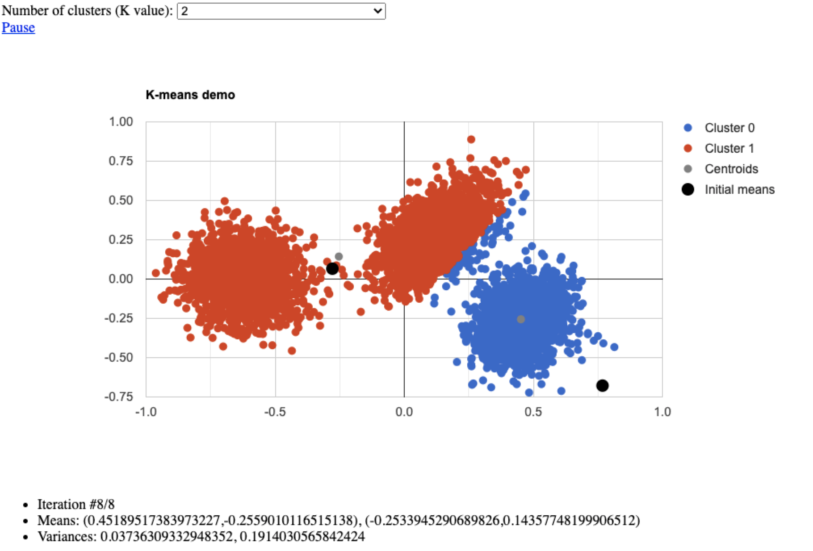

# Introduction to Scikit-learn (supervised learning)

## Refresh your mind... about machine learning types
Let's recall different types of machine learning algorithms.
- Supervised Learning: We are also given target outputs (labels, responses, output, classes): t<sub>1</sub>, t<sub>2</sub>,…, and the goal is to predict correct output given a new input.
- Unsupervised Learning: The goal is to find relations in x’s, which can be used for making predictions, decisions.
  - There is no outcome variable, just a set of measurements.
  - Objective can vary:
    1. find relationships between data points.
    2. find low dimensional representation of your data, etc.
- Reinforcement Learning: Learning system receives a reward signal, tries to learn to maximize the reward.

## Code snippet
In this part, we introduce some famous unsupervised learning algorithms implemented in Scikit-learn library.
```Python
>>> import numpy as np


# principal component analysis (PCA)
>>> from sklearn.decomposition import PCA
>>> X = np.array([[-1, -1], [-2, -1], [-3, -2], [1, 1], [2, 1], [3, 2]])
>>> pca = PCA(n_components=2)
>>> pca.fit(X)
PCA(n_components=2)
>>> print(pca.explained_variance_ratio_)
[0.9924... 0.0075...]
>>> print(pca.singular_values_)
[6.30061... 0.54980...]

>>> pca = PCA(n_components=2, svd_solver='full')
>>> pca.fit(X)
PCA(n_components=2, svd_solver='full')
>>> print(pca.explained_variance_ratio_)
[0.9924... 0.00755...]
>>> print(pca.singular_values_)
[6.30061... 0.54980...]

>>> pca = PCA(n_components=1, svd_solver='arpack')
>>> pca.fit(X)
PCA(n_components=1, svd_solver='arpack')
>>> print(pca.explained_variance_ratio_)
[0.99244...]
>>> print(pca.singular_values_)
[6.30061...]

# K-Means clustering
>>> from sklearn.cluster import KMeans
>>> X = np.array([[1, 2], [1, 4], [1, 0],
...               [10, 2], [10, 4], [10, 0]])
>>> kmeans = KMeans(n_clusters=2, random_state=0).fit(X)
>>> kmeans.labels_
array([1, 1, 1, 0, 0, 0], dtype=int32)
>>> kmeans.predict([[0, 0], [12, 3]])
array([1, 0], dtype=int32)
>>> kmeans.cluster_centers_
array([[10.,  2.],
       [ 1.,  2.]])
       
# Gaussian mixture model (implemented with expectation-maximization (EM) algorithm)
>>> from sklearn.mixture import GaussianMixture
>>> X = np.array([[1, 2], [1, 4], [1, 0], [10, 2], [10, 4], [10, 0]])
>>> gm = GaussianMixture(n_components=2, random_state=0).fit(X)
>>> gm.means_
array([[10.,  2.],
       [ 1.,  2.]])
>>> gm.predict([[0, 0], [12, 3]])
array([1, 0])
```

## KMeans demo
<div align="center" height=0.6 width=0.6>
  
</div>

## Clustering algorithms illustration
<div align="center" height=0.6 width=0.6>
  
  <span> Gaussian distribution to data </span>
</div>

<div align="center" height=0.6 width=0.6>
  
  <span> Gaussian mixture model on==to data (K = 2) </span>
</div>

<div align="center" height=0.6 width=0.6>
  
  <span> 2D Gaussians </span>
</div>

## Reference
- Murat A. Erdogdu [Introduction to ML & Least Squares](https://erdogdu.github.io/sta414/lectures/lec01/lec01.pdf)
- [sklearn.decomposition.PCA
](https://scikit-learn.org/stable/modules/generated/sklearn.decomposition.PCA.html?highlight=pca#sklearn.decomposition.PCA)
- [sklearn.cluster.KMeans](https://scikit-learn.org/stable/modules/generated/sklearn.cluster.KMeans.html?highlight=kmeans#sklearn.cluster.KMeans)
- [sklearn.mixture.GaussianMixture](https://scikit-learn.org/stable/modules/generated/sklearn.mixture.GaussianMixture.html#sklearn.mixture.GaussianMixture)
- [KMeans demo](http://syskall.com/kmeans.js/)
- Emad A. M. Andrews [k-Means & EM Algorithm](https://amfarahmand.github.io/csc311/lectures/lec09.pdf)
