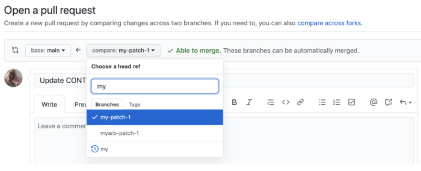
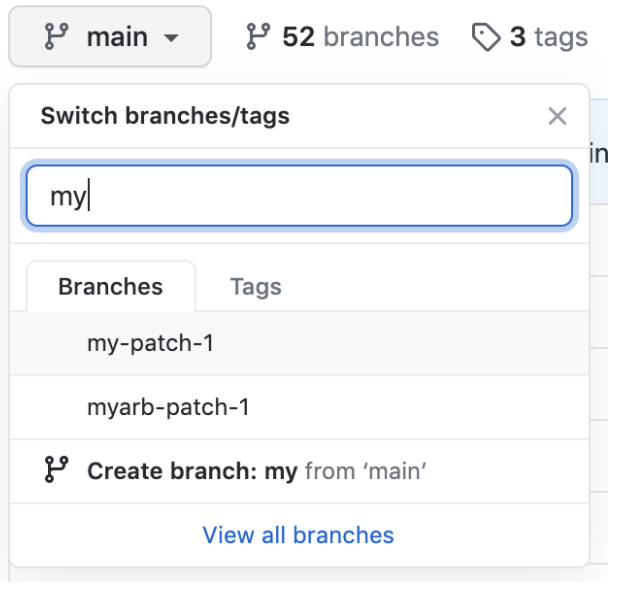
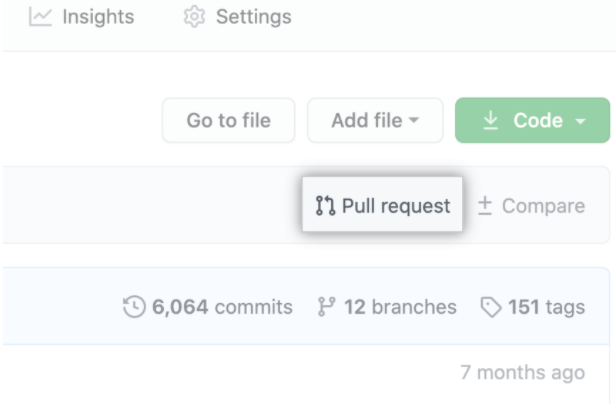
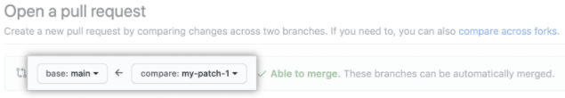
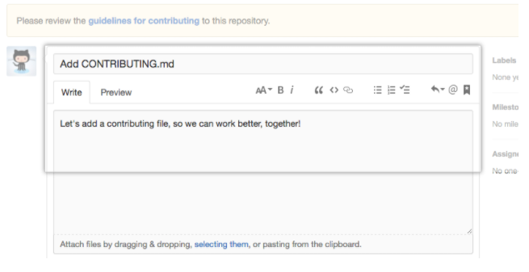
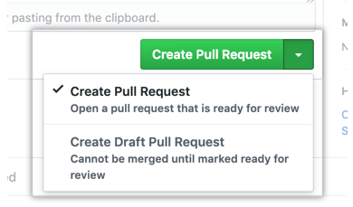

# Update your project on Github
Once you've established working in your repo, you should follow these steps when starting to work each time in the repo:
1. Update your local repo from the central repo (__git pull upstream master__).
2. Make edits, save, __git add__, and __git commit__ all in your local repo.
3. Push changes from local repo to your GitHub by using __git push__

## Recall: Cloning a repository
Last week we are talking about grabbing a complete copy of another user's repository by using __git clone__.

When you run __git clone__, the following actions occur:
* A new folder called *repo name* is made
* It is initialized as a Git repository
* A remote named __origin__ is created, pointing to the URL you cloned from
* All of the repository's files and commits are downloaded there
* The default branch is checked out

For every branch *foo* in the remote repository, a corresponding remote-tracking branch *refs/remotes/origin/foo* is created in your local repository. You can usually abbreviate such remote-tracking branch names to *origin/foo*. We will talk about branches and merging in the next week.

## Fetching changes from a remote repository
Use __git fetch__ retrieve new work done by other people. Fetching from a repository grabs all the new remote-tracking branches and tags *without* merging those changes into your own branches.

If you already have a local repository with a remote URL set up for the desired project, you can grab all the new information by using __git fetch *remotename*__ in the terminal:
<pre>
<code>
git fetch remotename
# Fetches updates made to a remote repository
</code>
</pre>

Otherwise, you can always a new remote and then fetch.

## Creating a pull request
Create a pull request to propose and collaborate on changes to a repository. These changes are proposed in a branch, which ensures that the default branch only contains finished and approved work.

If the default parent repository isn't correct, you can change both the parent repository and the branch with the drop-down lists. You can also swap your head and base branches with the drop-down lists to establish diffs between reference points. References here must be branch names in your GitHub repository.

  

Note: the base branch is where changes should be applied, the head branch contains what you would like to be applied.

1. On GitHub, navigate to the main page of the repository.
2. In the "Branch" menu, choose the branch that contains your commits.

  

3. Above the list of files, click __Pull request__.

  

4. Use the base branch dropdown menu to select the branch you'd like to merge your changes into, then use the compare branch drop-down menu to choose the topic branch you made your changes in.

  

5. Type a title and description for your pull request.

  

6. To create a pull request that is ready for review, click Create Pull Request. To create a draft pull request, use the drop-down and select Create Draft Pull Request, then click Draft Pull Request.

  

## References
- [Git 07: Updating Your Repo by Setting Up a Remote](https://www.neonscience.org/resources/learning-hub/tutorials/git-setup-remote)
- [Pushing changes to GitHub](https://docs.github.com/en/desktop/contributing-and-collaborating-using-github-desktop/pushing-changes-to-github)
- [Creating a pull request](https://docs.github.com/en/github/collaborating-with-issues-and-pull-requests/creating-a-pull-request)